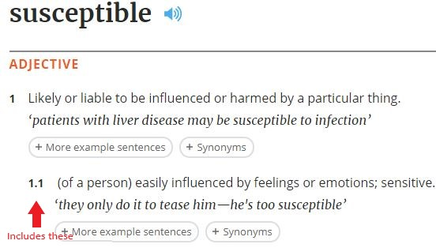

# Anki missing word (cloze) cards generator

 

This is a simple tool that helps you generate cloze cards for words that you want to memorize in english using the [oxford dictionaries api]

## How to use
* Install [Node](https://nodejs.org/en/)
* Clone this repository `git clone https://github.com/WinterCore/anki-missing-word-generator.git`
* Change your current working directory to the cloned repo `cd anki-missing-word-generator`
* Obtain an [oxford dictionaries api] APP_KEY and APP_ID (The free plan is about 3k requests a month, which is about 1500 words)
* run `npm install`
* run `npm run build`
* run `node dist/index.min.js -i [words_input_file] -o [cloze_cards_output_file] -k [APP_KEY] -d [API_KEY]` Check the [options](#options) below
* [import into anki](#importing-into-anki)
* Enjoy

## Options
* `-i [path]` or `--input-file [path]`

   The file that contains the english words that you want to generate the examples from, the words should should be separated by new lines (each word should be on its own line)

* `-o [path]` or `--output-file [path]`

   The file that contains the output data to be imported in anki (The front and the back of the card are separated by a semicolon `;`) see [importing](#importing-into-anki) below

* `-s` or `--include-subsenses`
   
   By default this app generates examples for main definitions only (integer numbers in the image below)
   Using this option will generate examples for subdefinitions (fractional numbers) eg: 1.1, 1.2, 2.1, 2.2

   

* `-c [number]` or `--count [number]`

   By default 2 sentences will be generated for each definition, use this option to specify how many sentences should be generated for each definition

* `-k [string]` or `--app-key [string]`

    [oxford dictionaries api] APP KEY

* `-d [string]` or `--app-id [string]`

    [oxford dictionaries api] APP ID

* `-f` or `--using-free-plan`

    Use this option if you're using the free plan of the [oxford dictionaries api]
    This throttles the requests to 59-60 per minute to prevent reaching the maximum of 60 requests per second
    This option might make the process slower but it is necessary to prevent the api from refusing requests after reaching the maximum

* `-h` or `--help`

    Ouputs usage formation

## Importing into anki

1. From the `file` menu select `import`
2. Select your output file
3. Import options
    * `Type` Should be set to `Cloze`
    * `Deck` Choose the deck that you want to import the cards into
    * `Fields separated by` Click on it to open the dialog and insert a single semicolo `;` then click on OK
    * `Allow HTML in fields` Should be checked
    * `Field 1 of file is` Should be `mapped to Text`
    * `Field 2 of file is` Should be `mapped to Extra`
4. Click on import

## License

[MIT](LICENSE)

**If you have any further questions feel free to open an issue and ask**

Thanks

[oxford dictionaries api]: https://developer.oxforddictionaries.com/ "Oxford Dictionaries API"